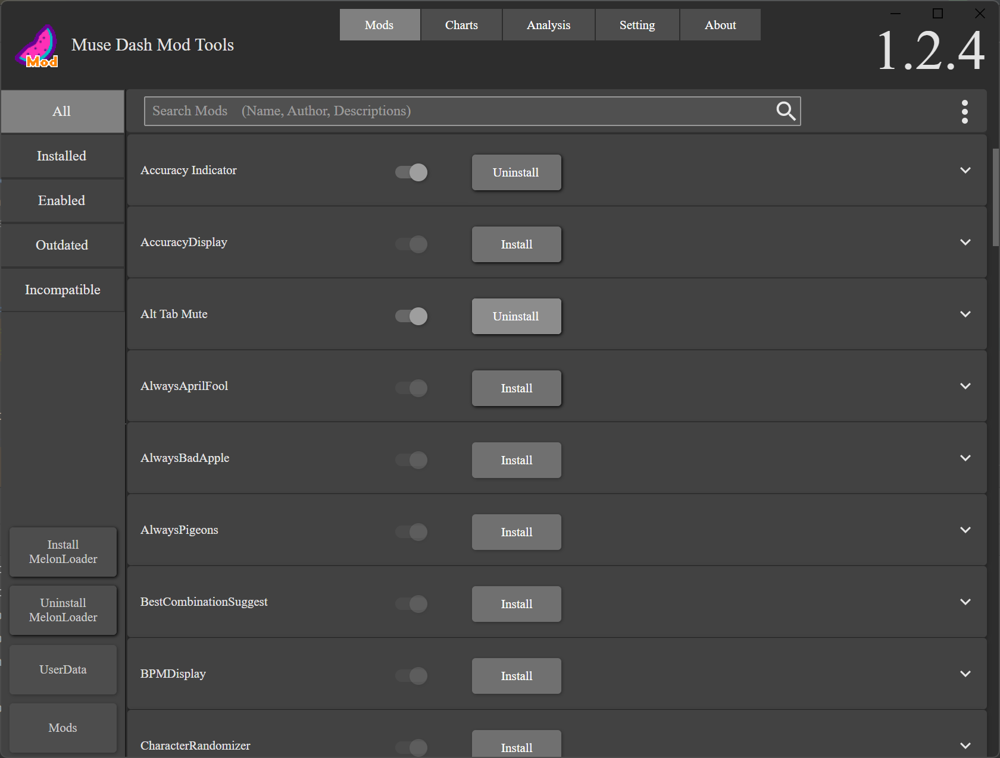
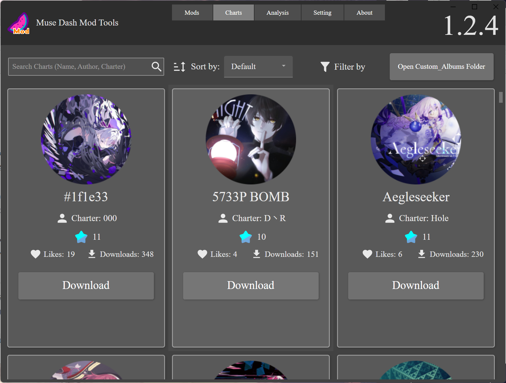
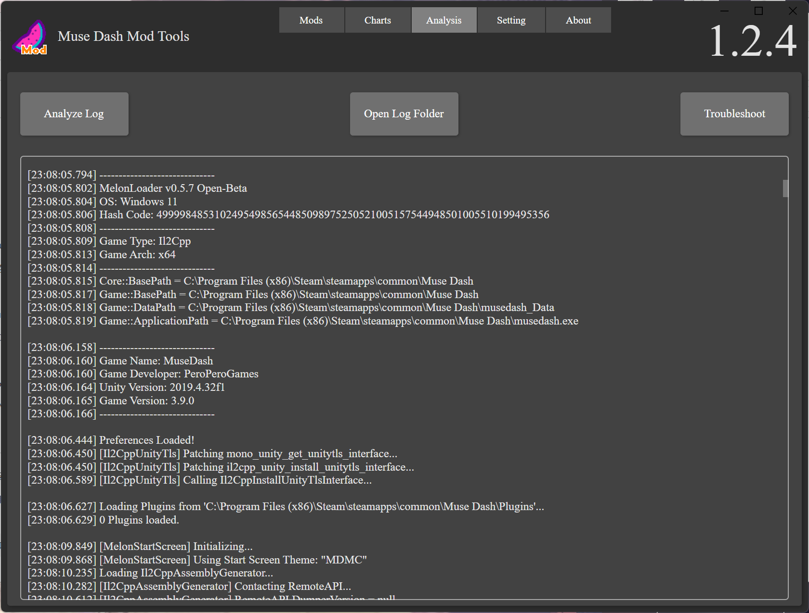
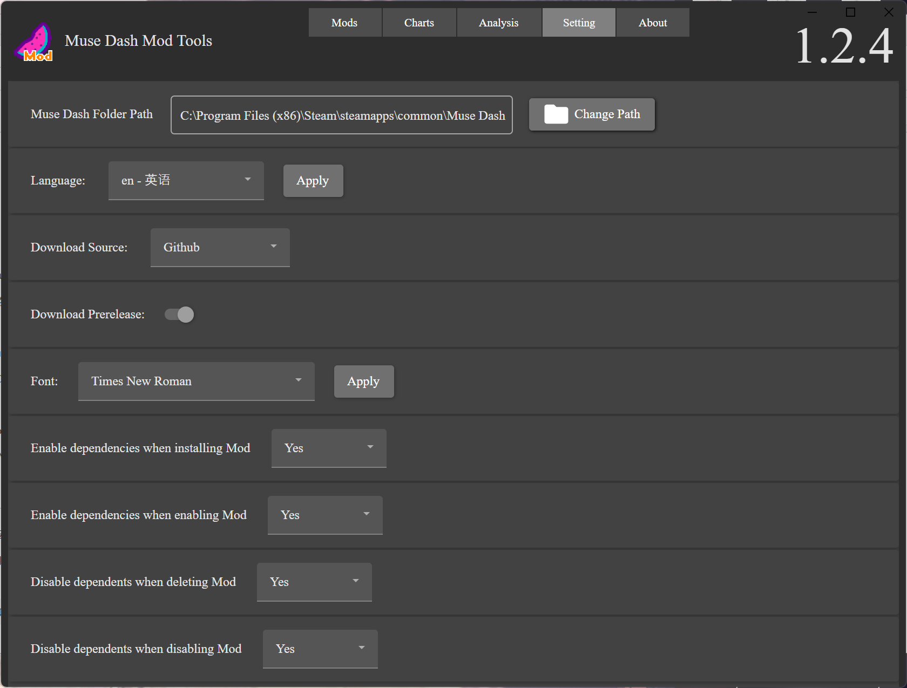
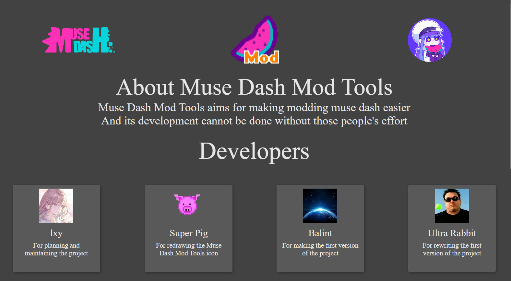
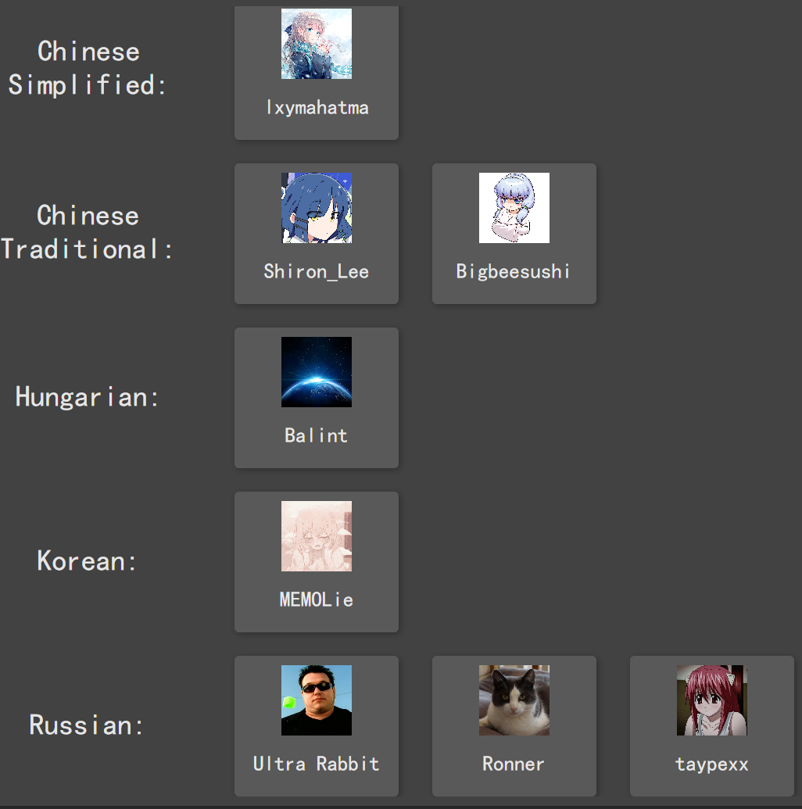

# MuseDashModToolsUI

> [!NOTE]
> The Project is currently under completely rewrite, master branch is no longer maintained.
> 
> If you want to contribute to the project (Especially the UI part), see [rewrite branch](https://github.com/MDModsDev/MuseDashModTools/tree/rewrite) and contact [lxymahatma](https://github.com/lxymahatma) for more information.
> 
> Translations are currently stopped until the rewrite is finished.

**A UI app making muse dash modding easier**

[中文说明](https://www.bilibili.com/read/cv22748380)

## Usage
1. Download and install MelonLoader from this app (Which is needed for muse dash modding)
2. Install mods with a simple click.
3. Disable/Enable mods with the toggle.
4. Warn you with the different color button if your mod version is incorrect.
5. Search the mod by name, author, and description using the search bar.
6. Different category filter types for mods on the Mod page left side.
7. Download charts from the app (You can search, sort, and filter charts)
8. Roughly analyze your log file when launching the game meet problems.
9. Setting window for adjusting font and language, changing download source of mods (Github, Github Mirror, Gitee, or custom links)

## Screenshots

### Mod Manage Page

### Charts Download Page

### Log Analysis Page

### Setting Page

## Translation

### Current Supported Languages:

1. English (Default)
2. Chinese Simplified (Full)
3. Chinese Traditional (Full)
4. Croatian (None)
5. French (None)
6. German (Partial)
7. Hungarian (Full)
8. Japanese (Partial)
9. Korean (Partial)
10. Russian (Full)
11. Spanish (Full)

**If you want to contribute to translation, use [Crowdin](https://crowdin.com/project/musedashmodtools) to translate.** (If you cannot find the language you want to translate, ask me on Discord or create an issue.)

**Also, Notice That The Translation is not real-time updated. I have to update the translation file and release a new version manually.**

## ChangeLog
### See [CHANGELOG.md](CHANGELOG.md)

## Nightly Versions
**The following links are the nightly builds from github action for this app from dev/rewrite branch. It may be unstable and have bugs. Use it at your own risk.**

* [Linux Build (Self Contained)](https://nightly.link/MDModsDev/MuseDashModToolsUI/workflows/build/dev%2Frewrite/MuseDashModToolsUI-Release-Linux-net7.0-x64-self-contained.zip)
* [Windows Build (Self Contained)](https://nightly.link/MDModsDev/MuseDashModToolsUI/workflows/build/dev%2Frewrite/MuseDashModToolsUI-Release-Windows-net7.0-x64-self-contained.zip)
* [Linux Build (Runtime Required)](https://nightly.link/MDModsDev/MuseDashModToolsUI/workflows/build/dev%2Frewrite/MuseDashModToolsUI-Release-Linux-net7.0-x64-runtime-required.zip)
* [Windows Build (Runtime Required)](https://nightly.link/MDModsDev/MuseDashModToolsUI/workflows/build/dev%2Frewrite/MuseDashModToolsUI-Release-Windows-net7.0-x64-runtime-required.zip)

*Self Contained means you don't need to install any other things to run this app, and Runtime Required means you need to install .NET 7.0 Runtime to run this app.*

## Contribution

## Credits (See About Page)
### Developers

### Translators

