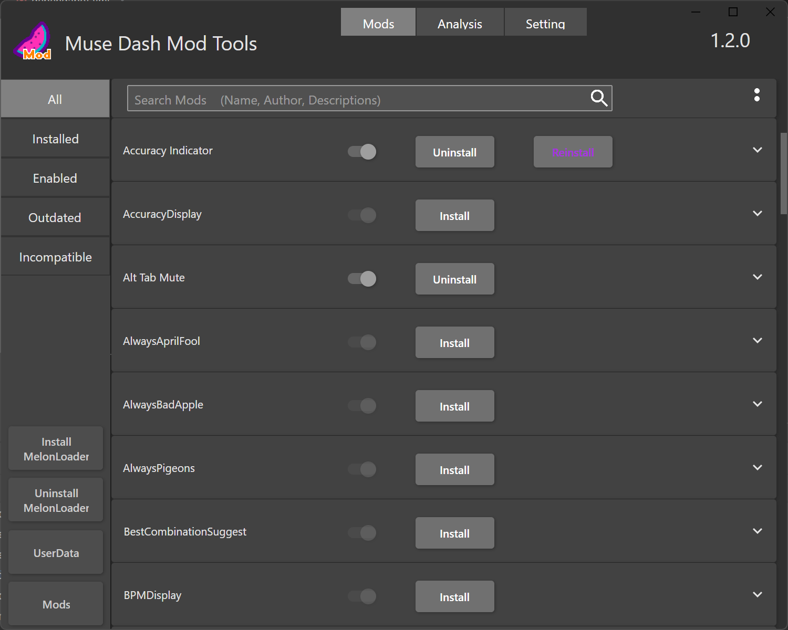

# MuseDashModToolsUI

### V1.2.0 Prerelease is available now!
[Prerelease Download](https://github.com/MDModsDev/MuseDashModToolsUI/releases/tag/1.2.0-rc1)

## A UI app for making muse dash modding easier
[中文说明](https://www.bilibili.com/read/cv22748380)

### What it can do
1. Download and install MelonLoader from this app (which is needed for muse dash modding)
2. Install mods with a simple click.
3. Disable/Enable mods with the toggle
4. Warn you with the different color button if your mod version is incorrect.
5. Search the mod by name, author, and description using the search bar
6. Different category filter types on the left side
7. Roughly analyze your log file when launching the game meet problems
8. Setting window for adjusting font and language at runtime
9. Change download source of mods (Github,Github Mirror or Gitee)

### Screenshot

### Translation

#### Current Supported Languages:

1. English (Default)
2. Chinese Simplified
3. Chinese Traditional
4. Hungarian
5. Russian
6. Spanish

**If you want to contribute to translation, use [Crowdin](https://crowdin.com/project/musedashmodtools) to translate.** (If you cannot find the language you want to translate, ask me on discord or create an issue)
